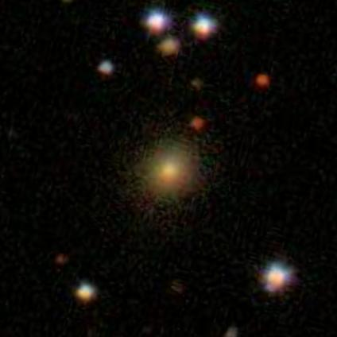
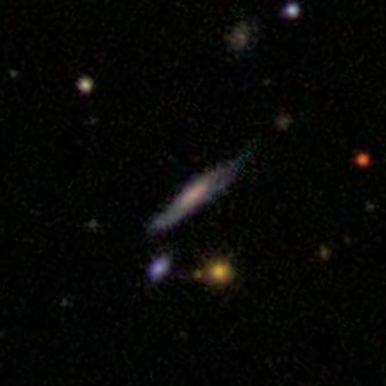

# Gan-Galaxy
GAN model with keras and Galaxy datasets

# Built with
* [Keras with TensorFlow](https://keras.io/) Use to build model
* [Numpy](http://www.numpy.org/) Use to build model
* [PIL](https://pillow.readthedocs.io/en/3.1.x/index.html) Use to load and save images
* [Pickle](https://docs.python.org/3/library/pickle.html) Use to load and save images

# Running

I used Google Cloud to run my program (cause my mac kept crashing)
This code is the one I used along with the entrainer.sh, config.yaml and setup.py files for Gcloud.
Note : You may want to change some parts if using on your computer

# Input example

I've put all my input images in a pickle file.
Here's an example of my input :

# Output example

I tried to improve my code a few times.

The first output are in 'Ganaxy Image 1' folder.
Here's an example:

The second output are in 'Ganaxy Image 2' folder.
Here's an example:

The third output are in 'Ganaxy Image 3' folder.
Here's an example:

The fourth output are in 'Ganaxy Image 4' folder.
Here's an example:

The fifth output (for this code) are in 'Ganaxy Image 5' folder.
Here's an example:

Though it's not what I wanted, I really like the weird green and pink galaxies !
